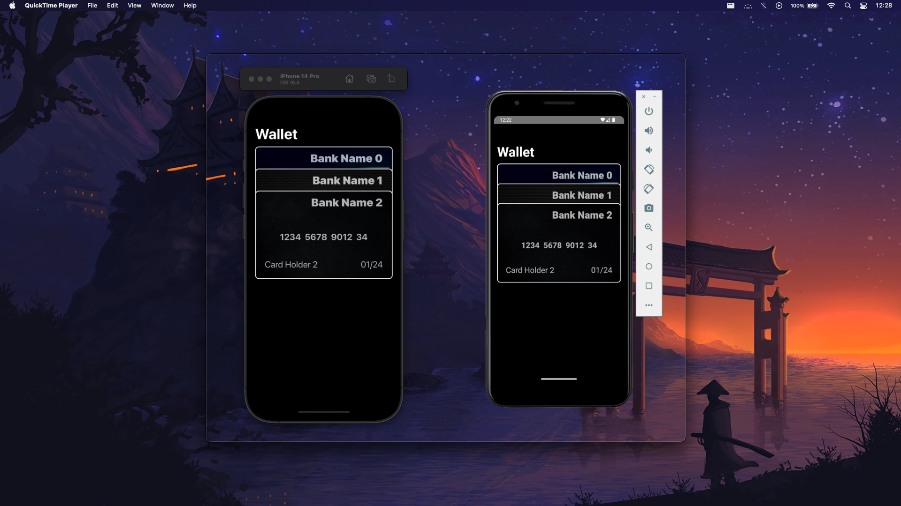

# Apple Wallet Clone in ReactNative

### Click below image to watch the video
[](https://youtu.be/eJoyWtnbn_I)
Video Link: https://youtu.be/eJoyWtnbn_I

### React Native Version
The current version of React Native being used in this project is `0.72.1`.

### To clone the repo
```git
git clone https://github.com/bibin-jaimon/rn-wallet.git
```
### To setup the project

Make sure you have configured react-native in your system properly

```
cd rn-wallet
npm install
npx pod-install ios
```

### To run Android App
```
npx react-native run-android
```

### To run iOS App
```
npx react-native run-ios
```

### More info
- Starting folder for the project is `src/main/app.tsx`
- The package used for navigation is `@react-navigation/native-stack`
- The package used for shared element animation is `react-native-reanimated`
- Open issues
    - Scrolling issue in Android